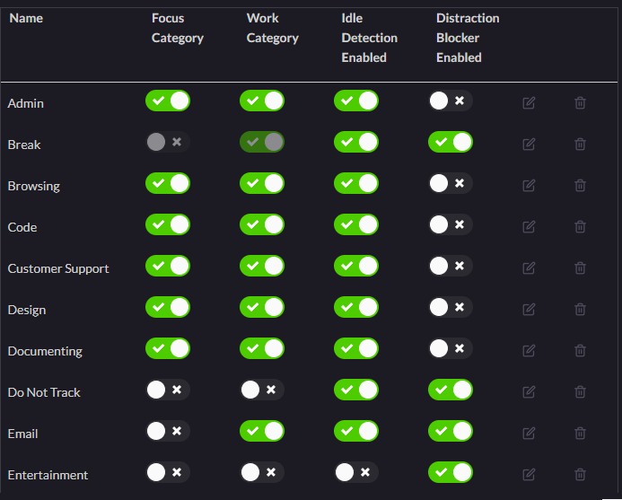

# BLAZE

## Ideas of BLAZE

- flow creation
- privacy
- project management
- teams
- ease of use
- community
- connectivity

## Features

**1st Version**

- initial setup
- Track (applications and history), Display (days, weeks, months, years) with categories (prebuilt, setup) => Tracking
  of window, title, urls, afk (store them locally)
- default categories of programs (_program->categories_->states(flow,work,idle,distraction)) => Settings of categories
- auto & self flow-sessions, breaks(idle detection), meeting, workout (duration changing).
- stoping distractions
- go cloud
- set client projects and tasks
- widget

**_Small updates_**

- commands
- Activity =>
    - time zone
    - time format
    - setting start of the week
    - set routines
    - work target
    - Day Cutoff Time
- export data

## Strategy

- data store -> local then cloud
- settings store -> store plugin (+category state)
- settings of grouping rules(program category) -> sql

---

**2nd Version**

- music
- privacy => tracking(url, title, schedule deletion, All data deletion, store-locally) + editor + browser(web) + media
- insights
- leaderboard
- Specific features
    - integration notion, task(clickUp, Google Tasks, zapier), calender(notion-calender, google-calender,
      microsoft-calender)

**3rd Version**

- integrating with other tracking app or importing tracking data

**_Categories on and off auto_**

 

## Essential Add-Ons

- Payment Gateway
- Authentication
- Email Provider

``` 
    let win_builder = WebviewWindowBuilder::new(app, "main", WebviewUrl::default())
      .title("Transparent Titlebar Window")
      .inner_size(1024.0, 720.0).min_inner_size(1024.00
      // set transparent title bar only when building for macOS #[cfg(target_os = "macos")]
      let win_builder = win_builder.title_bar_style(TitleBarStyle::Transparent);
      
      let window = win_builder.build().unwrap();

      // set background color only when building for macOS
      #[cfg(target_os = "macos")]
      {
          use cocoa::appkit::{NSColor, NSWindow};
          use cocoa::base::{id, nil};

          let ns_window = window.ns_window().unwrap() as id;
          unsafe {
              let bg_color = NSColor::colorWithRed_green_blue_alpha_(
                  nil,
                  50.0 / 255.0,
                  158.0 / 255.0,
                  163.5 / 255.0,
                  1.0,
              );
              ns_window.setBackgroundColor_(bg_color);
          }
      } 
            
```

``` 
useEffect(() => {
    async function createMenu() {
      const menu = await Menu.new({
        items: [
          {
            id: "quit",
            text: "Quit",
            action: () => {
              console.log("Quit pressed");
              // Implement your quit action here
            },
          },
          {
            id: "settings",
            text: "Settings",
            action: () => {
              console.log("Settings pressed");
              // Implement your settings action here
            },
          },
        ],
      });

      await menu.setAsAppMenu(); // For macOS, this sets the menu in the application's top bar

      listen("menu-event", (event) => {
        switch (event.payload) {
          case "quit":
            // Handle the quit event
            console.log("Quit event received");
            break;
          case "settings":
            // Handle the settings event
            console.log("Settings event received");
            break;
          default:
            console.log("Unimplemented menu event:", event.payload);
        }
      });
    }
    createMenu();
  }, []);
```

# How to use ipc in the right way

- calling ipc_commands (ipc.ts=create_all_commands => view(app-v.ts uses ipc_project_command)
- init model_manage in build of tauri and init store (db, ses)
- ipc(ctx) -> model(bmc_ctx) -> bmc(get_model_manage && store ) -> surreal_store (query exe)

# Design of the app

- Design of DB
- IPC design
- business logic design
- Invoke design
- frontend result design

# types of tracking programName, title & url

# later customize the app

- menu && tray icon menu
- installer gui
- getting up commands && global shortcuts
- change theme with animation (transparent theme)
- widget for desktop && phones

- remove the start screen white background or display when ready (visible: false, focus: true -> check this as this may
  not work in all platforms)  = visible: true, focus: true
